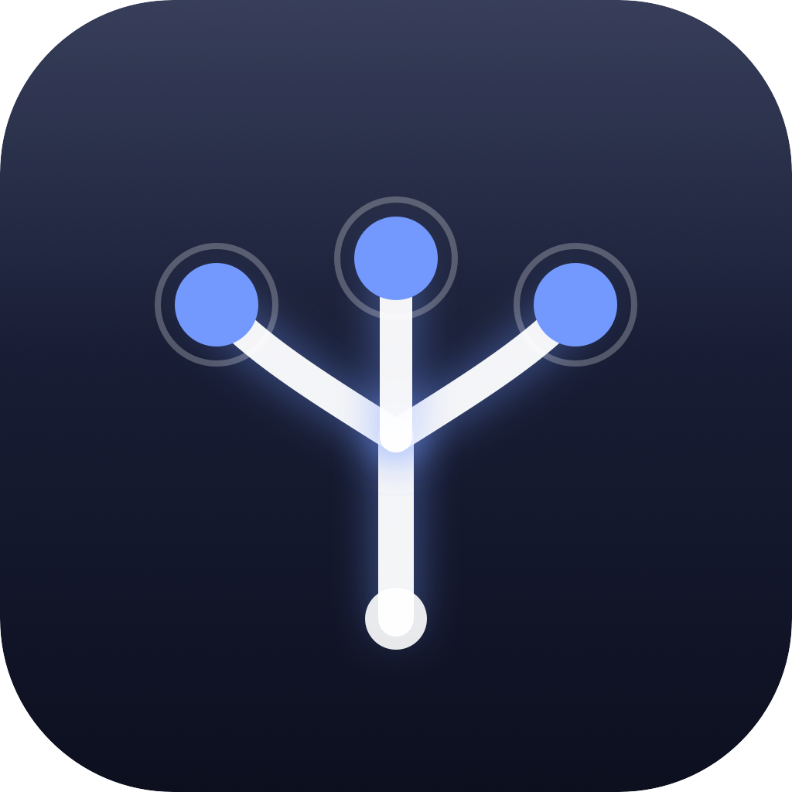

<p align="center">
  
  <br />
  <h1 align="center">kevMac</h1>
  <p align="center">Plain questions in. Calibrated answers out. All on your Mac.</p>
  <p align="center">
    <a href="https://github.com/arinltte/kevMac/releases/latest"></a>
    <a href="https://github.com/arinltte/kevMac/blob/main/LICENSE"></a>
    
    
  </p>
</p>

---

**kevMac** is a lightweight macOS app for the [kev](https://github.com/jaredpalmer/kev) decision model. Paste any document — a customer message, a review, an article — build questions as simple forms, and get calibrated answers with animated probability bars. The app converts your form into the engine's JSON contract automatically, and turns the JSON result back into plain language. No terminal, no JSON, no button presses on a website. One setup button, and everything runs locally on your Apple Silicon Mac.

---

## 🏗️ Features

- **Plain text in** — Type or paste a document and build questions as simple forms. Each question picks a type: *Yes / No* (with optional "what Yes / No means" descriptions), *Multiple Choice* (named options with optional descriptions), or *Rating* (ordered levels, worst → best).
- **JSON, invisibly** — The form is converted into the kev `/v1/systemone` contract automatically. You never see or write JSON.
- **Normal text out** — Answers render as plain language — *"Returns — 83% confident"* — with animated probability bars (critically damped springs), confidence captions, and latency + token usage. A **Copy Report** button puts a plain-text summary on the clipboard.
- **Add / remove everything** — Questions, choice options, and rating levels each have add and remove buttons, validated inline (a choice needs at least two named options, a rating at least two levels).
- **Examples** — Three presets: **Support triage** (the shoes-arrived-late example), **News article**, and **Review rating**.
- **One-button setup** — The first launch installs everything into a dedicated `~/.kevMac` folder automatically: uv, Python 3.13, the kev engine, and the model weights. The weights download by themselves — no button press.
- **Runs fully offline after setup** — The engine serves from `~/.kevMac/Cache`, starts on launch, health-checks, and warms up in the background so your first real question answers fast.

---

## Requirements

- An Apple Silicon Mac (M1 or later), macOS 14.6 or later.
- Xcode, to build and run the project.
- ~3 GB of free disk space and an internet connection for the one-time setup.

---

## 🚀 Installation

### Build & run

```bash
git clone https://github.com/arinltte/kevMac.git
cd kevMac
open kevMac.xcodeproj
```

Press **Run** in Xcode. On first launch, the setup wizard appears.

### One-time setup

Press **Start Setup** — everything happens automatically, in this order:

| Step | What happens |
| --- | --- |
| 1 | Checks for `uv` (installs it via Homebrew if missing) |
| 2 | Fetches the kev engine (no git needed — macOS `curl` + tarball) |
| 3 | Installs **Python 3.13** via uv — pinned explicitly, because torch ships no wheels for 3.14 |
| 4 | Creates the virtual environment and installs the engine dependencies (`uv sync --extra serve`) |
| 5 | Downloads the **kev-0.6b** adapter and its pinned **Qwen3-0.6B-Base** base model (~1.2 GB) — no button press |

The wizard skips any step that is already done, so updating the app (or switching models) only downloads what is missing.

---

## Getting Started

1. Press **Start Setup** and wait for **Engine ready** in the results pane.
2. Paste a document into the **Document** field — the Support triage example is prefilled on first launch.
3. Edit the questions: pick a type, fill in the instructions, add or remove options with the **+ / −** buttons.
4. Press **Analyze** (or **⌘↵**) — the answers appear as animated cards with probability bars.
5. Press **Copy Report** to put a plain-text summary on the clipboard.
6. Load a different example from the **Examples** menu in the toolbar.

---

## ⚙️ Question types

| Type | What it answers | Form fields |
| --- | --- | --- |
| Yes / No | A yes/no question — shown as **Yes** or **No** with a certainty percentage | Instructions + optional "Yes means" / "No means" |
| Multiple Choice | Picks one option — shown as the option name with a confidence caption and a probability bar per option | Instructions + named options (with optional descriptions) |
| Rating | An ordered scale — shown as the nearest level with the expected value (e.g. "expected 1.0 of 3") | Instructions + ordered levels (worst → best) |

---

## 📊 Tested

Measured on a MacBook Pro (M4, 16 GB): at steady state — the decision engine with `kev-0.6b` loaded on MPS plus the SwiftUI app — **kevMac stays under 3.5 GB of RAM** (engine ~3.4 GB, app ~75 MB). Answers land in ~0.1–0.6 s after the background warm-up. A fresh install downloads ~2.2 GB into `~/.kevMac` (Python environment ~1 GB + model weights ~1.2 GB); nothing is installed outside that folder.

---

## 📂 Data & Privacy

**kevMac** installs the following locally and transmits **nothing** during use — no telemetry, no analytics, no background network calls (the only network traffic is the one-time setup's downloads).

| Location | Contents |
| --- | --- |
| `~/.kevMac/kev/` | The kev engine repository and its Python virtual environment |
| `~/.kevMac/Cache/` | Downloaded model weights (kev-0.6b adapter + Qwen3-0.6B-Base) |
| `~/.kevMac/Python/` | The uv-managed Python 3.13 interpreter |
| `~/.kevMac/uv-cache/` | uv's package cache |
| `~/.kevMac/Temp/` | Scratch space |

Nothing is installed outside `~/.kevMac`. To remove everything and start fresh:

```bash
rm -rf ~/.kevMac
```

---

## Upgrading models

The model is pinned in `KevManager.swift` (`--run jaredpalmer/kev-0.6b`) and `SetupManager.swift` (weight-cache detection + download). To switch checkpoints (e.g. `kev-4b`), change the Hub id in both places — the setup wizard downloads whatever is missing on next launch.

---

## 🤝 Contributing

Contributions are welcome. Whether it's a bug report, a feature suggestion, a documentation improvement, or a pull request — all are appreciated.

**To contribute:**

1. Fork the repository.
2. Create a feature branch: `git checkout -b feature/your-feature-name`
3. Commit your changes with a clear message.
4. Open a pull request against `main` with a description of what you changed and why.

**To report a bug or request a feature**, open an [issue](https://github.com/arinltte/kevMac/issues). Please include your macOS version and steps to reproduce for bug reports.

---

## 📜 License

Distributed under the MIT License. See `LICENSE` for more information.

The decision engine is [kev](https://github.com/jaredpalmer/kev) by Jared Palmer (Apache-2.0); the `kev-0.6b` weights are on the [Hugging Face Hub](https://huggingface.co/jaredpalmer/kev-0.6b). The base model [Qwen3-0.6B-Base](https://huggingface.co/Qwen/Qwen3-0.6B-Base) carries the Qwen license.

<p align="center">
  <i>Developed by arinltte · arinltte00@gmail.com</i>
</p>
